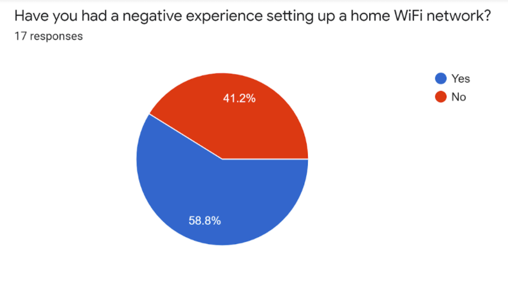
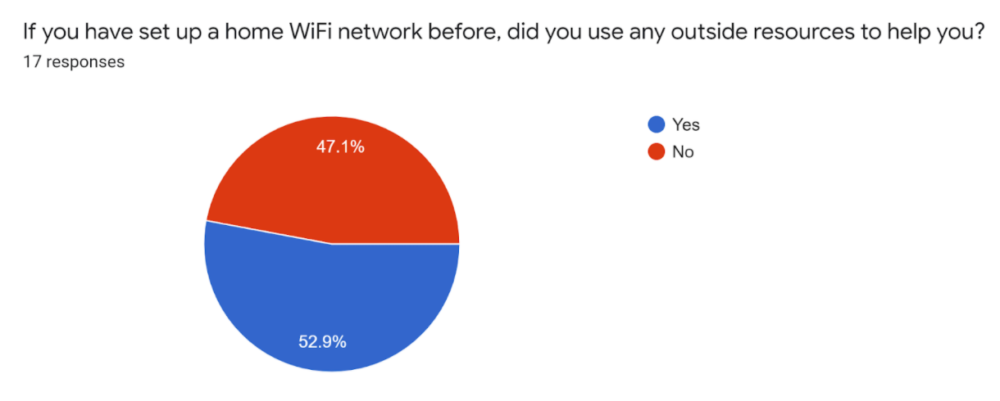
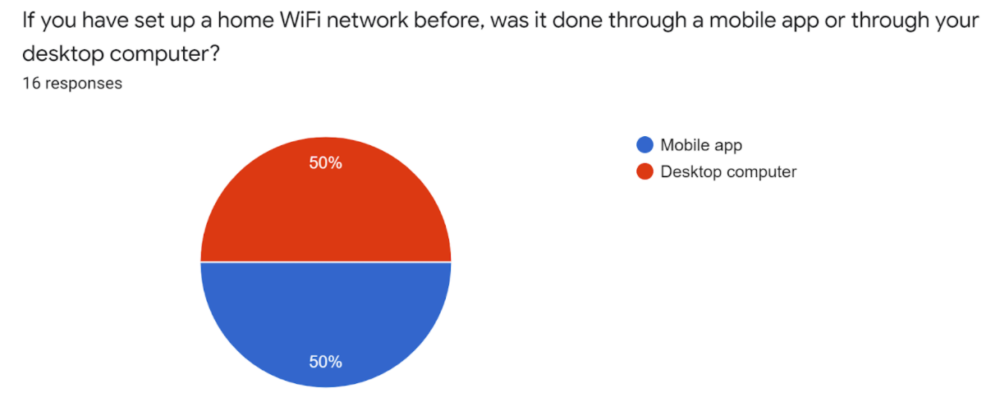
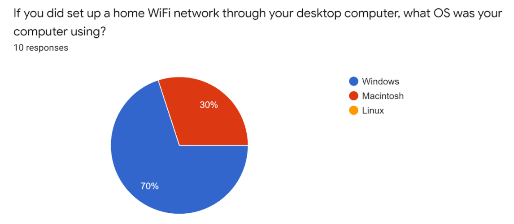
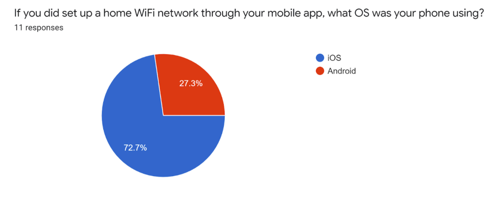

# Chico Fish, Phase 1: Requirements Gathering

## Executive Summary

* Naturalistic observation of participants (n=5) having different methods in setting up their home WiFi that includes obstacles that they had encountered. Majority of them seek out troubleshooting assistance.
* Online survey on users (n=17) of different experiences with home WiFi setups.
* Our research revealed that at least half of participants relied on some sort of service for setup assistance.
* At least half of participants had negative experiences setting up their home WiFi network.
* Designed personas and scenarios:
	* **Robert**: Military veteran in late 70s wants to have internet to connect with friends
	* **Emily**: College student that wants internet for the apartment but bound to encounter problems with connections with the internet.
***
## Methods

We used a survey and naturalistic observation methods to gather data for this project.  We first chose the survey method since it would be the easiest and most efficient way of gathering data, since we 8can just mass distribute the link to our survey to get responses.  Our second method was naturalistic observation, as we thought we could gain valuable data from watching someone attempt to set up their home network.  Although, since we are currently learning from home due to the pandemic, we had individuals describe to us in detail their experience with setting up their home network.  The size of the survey group is n=17, and the size of our naturalistic observation group was n=5.
***
## Findings

We collected mock data and generated some graphs from the result.

* The amount of people within our class who had a negative experience setting up a home WiFi network is greater than the people who had a positive experience.

* The amount of people within our class who used outside resource for assistance when setting up a home WiFi network is greater than the people who didn't.

* It is split between the middle on whether students have set up a home WiFi network on mobile app or desktop computer.

* Majority of the class who set up a home WiFi network on desktop computer did it on a Windows machine, and the rest on Macintosh. No one set up on Linux.

* In terms of the people who set up their home WiFi network on a mobile device, majority did it on iOS, and the rest on Android.
***
# Responses

When asked if there was anything the users would change to improve their experience, we received the answers:
* "Yes"
* "Basically everything"
* "More specific instructions"
* "There is nothing really"
* "I don’t think so"
* "Lots of random issues, a streamlined way of setting up would be best"
* "Get someone else to do it for me"
* "Indicator that helps find placement and configuration with least interference"
* "Was rather simple, only needed to do three things I don’t know how you could improve on it much"
***
## Conclusions

Regarding the questionnaire, there were many interesting conclusions that we made. One thing that we discovered was that a good amount of people did not use any outside resources to help themselves while setting up their WiFi network. We expected a good majority of people to have used an outside resource as an aid. With 58.8% of people having a bad experience, it makes you think if using outside resources would have helped them. We figured that some people like to do things themselves without the need for guidance. We also concluded that a good majority of people don’t use Linux as an operating system. Our survey returned zero users using Linux as a means of setting up their network. We also concluded that as expected, iOS is the superior phone operating system as about 73% of people used iOS as a means of setting up their network.
	Regarding our method of naturalistic observation, we found that many people had to call their Internet Service Provider (ISP) for assistance in the process. One of our volunteers was able to set it up by themselves, but still had to call their ISP after they had blocked his internet connection due to a new unknown device. Another conclusion that we came to was that even in the best scenarios where the user was able to get their network setup, they still ran into a minor issue that forced them to have to troubleshoot something.
***
## Caveats

Due to the ongoing covid-19 pandemic, we weren’t able to collect as much data as we
would have hoped.  I believe we would have been able to get a lot more participants for our survey if we were in person, as not too many people are very inclined to willingly take a survey link online.  I believe we also would have been able to get more accurate data from our naturalistic observations if we were in person.  While the descriptions of experiences we received were great, a lot of details were left out due to the individual not being able to remember them, or not willing to mention them.
***
## Supplementary Materials

Survey: https://docs.google.com/forms/d/e/1FAIpQLSeP1IQISey-KGsWtA1eXO8S-nzSzCIwvmGskwaJQzNzZEG9bw/viewform

Naturalistic Observation: https://docs.google.com/document/d/1oZumXPlu1UcA48N91bHH8pi_XS-HEUGmv2vNSP9EJ44/edit?usp=sharing

**Personas and Scenarios** 
[See dedicated page for Personas and Scenarios created from Phase 1 findings](../personas-scenarios.md)

